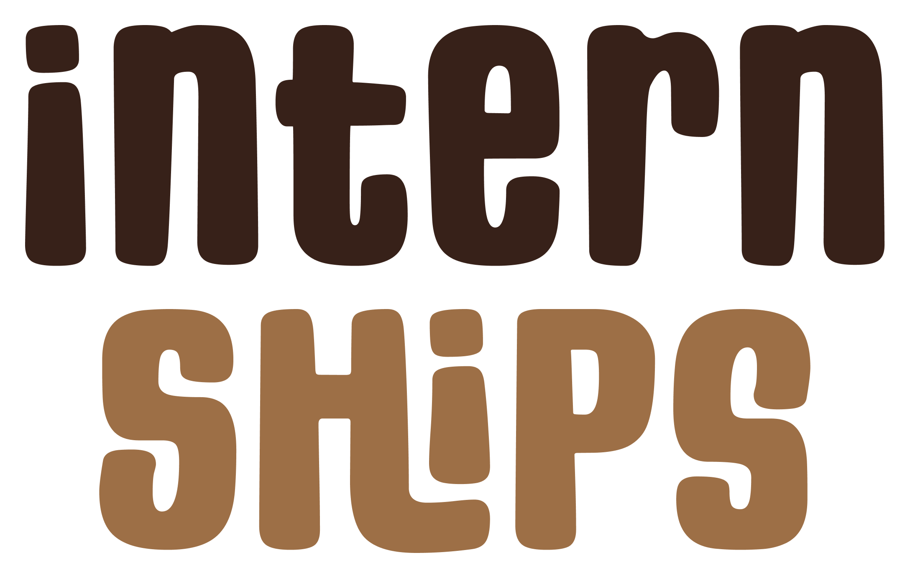
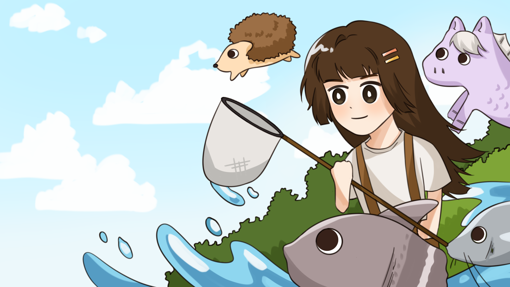
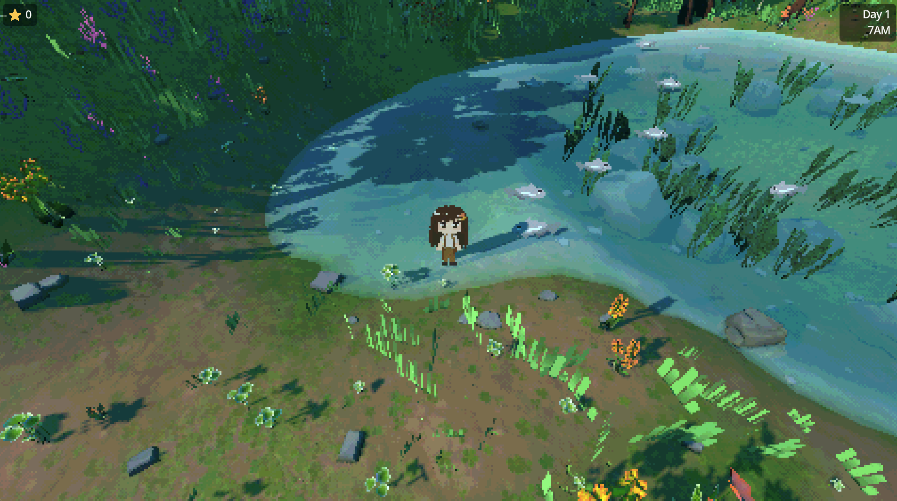
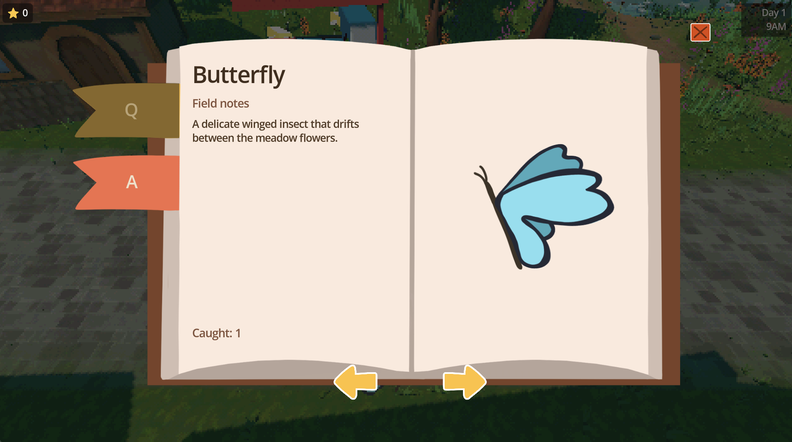
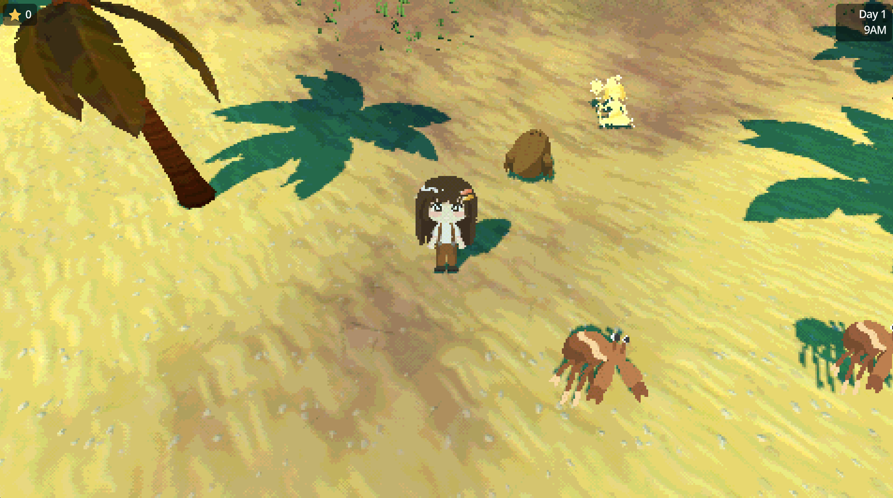
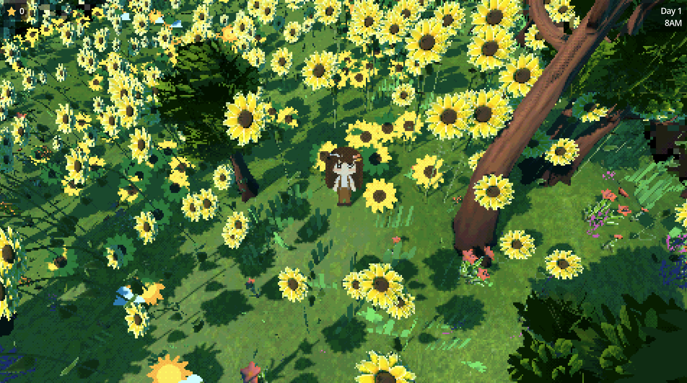

<div align="center">



### A cozy animal-catching game — where not every "aminal" is what it seems.

</div>

## 🌿 What is it?

[Intern Ships](https://rukoilla.itch.io/intern-ships) is a relaxing animal-catching game built in **Godot 4.7** as part of [Comfy Jam Summer 2026](https://itch.io/jam/comfy-jam-summer-2026).

Play as a new unpaid intern at **Aminal Catcher Co**. Roam **stylized biomes**, toss your lasso and **catch countless animals**, fill out your **Logbook**, all while not getting paid a single dime! But watch out... Alongside the real wildlife, sneaky **"aminals"** are hiding in the bushes. Tell the genuine from the fake by mastering your English, complete quests from the higher-ups, and earn your rewards!

## 🚀 Running the game

```bash
# Open in the Godot 4.7 editor
godot project.godot

# Or run headless / export builds via the configured presets
godot --headless --export-release "<preset>"
```

---

## 🏞️ Gallery

<div align="center">








---

*Made with 🍎 in Godot.*

</div>
